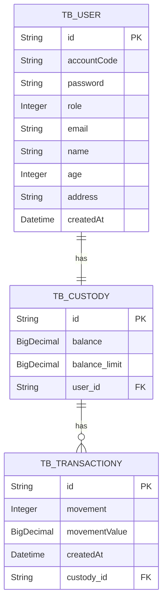

# BrandBanking API

An api which allows trasactions crediting ou debiting user's balance

## :books: Features:
* <b>User's Registration</b>: Allows users registration. Payload example:
```
{
  "email": "test@gmail.com",
  "name": "John",
  "password": "123",
  "age": 23,
  "address": "Street alamedas"
}
```
The user's account code is generated automatically.

* <b>Post Transactions</b>: allows users to move their balance by launching transactions, crediting or debiting the balance.
```
POST /transactions/debt/{value}
i.e.
/transactions/debt/1.23
```

```
POST /transactions/credt/{value}
i.e.
/transactions/credt/8.17
```

* <b>Check users transactions</b>: allows users to consult all transactions carried out in a paged format.
```
GET /transactions?{paginationParameters}
i.e.
/transactions?page=0&linesPerPage=10&direction=DESC&orderBy=created_at
```

* <b>Swagger</b>: allows to see all API's endpoints, allowing to an authentication token to test and see the expected payloads from each endpoint.
```
Enter the url:
http://localhost:8080/swagger-ui/index.html
```
* <b>Authentication & Authorization</b>: The API implemented JWT authentication, all endpoints require a JWT except

`/users/register` : Registration endpoint

`/login` : Authentication endpoint

`/swagger-ui/index.html` : Swagger endpoint

Authentication payload:
```
{
  "accountCode": "12760.00",
  "password": "123"
}
```

More details about autenticated routes at **[SecurityConfig.java](https://github.com/AriTedeschi/BrandBank-api/blob/main/src/main/java/com/brandbank/transactions/application/configuration/SecurityConfig.java):**

## :clipboard: Backlog

The project uses Github Projects as a development board to save all features on **[Backlog](https://github.com/users/AriTedeschi/projects/1):**


## :computer: Entity relationship diagrams



## 🔧 Dependencies
The project requires Maven, Java 17 and a Postgrees database to run the projects
Thus, the projects uses those enviroment keys:
```
JWT_SECRET=;
SPRING_DATASOURCE_IP=<ip>:<port>
SPRING_DATASOURCE_DBNAME=/brandbank;
SPRING_DATASOURCE_SCHEAMA=?currentSchema=public;
SPRING_DATASOURCE_USERNAME=;
SPRING_DATASOURCE_PASSWORD=;
```

The project provides a "dev" execution profile that uses the H2 in-memory database, in this profile it is not necessary to perform any connection configuration

To use the dev profile, change the **[application.properties](https://github.com/AriTedeschi/BrandBank-api/blob/main/src/main/resources/application.properties):** file as follows
```
spring.profiles.active=dev
```

## 🚀 Running

The api provides a bunch of docker-compose files which allows a quick setup for a local running or a test enviroment running.

### :hammer_and_wrench: Local run

Once you installed docker, open the command prompt at directory `/docker` and run docker-compose command to start up.
```
docker compose up
```

By running this command it uses 3 files
- Dockerfile: a custom image which compiles project's binaries and runs using a jre image 
- docker-compose.yml: which names the custom docker file
- docker-compose.override.yml: which segregates containers configurations such as enviroments variables, profiles, exposed ports and more. It automatically runs after docker-compose.yml. By default it runs at `:8080`but it is possible to change setting up this file.

With that it is possible to test using swagger at **[Swagger-ui](http://localhost:8080/swagger-ui/index.html):**

To clean up after execution use:
```
docker compose down
```

### :test_tube: Enviroment run

To simulate an enviroment it uses `postgree's` database to persist data even after closing the application. 

This approach requires an additional configuration of docker. It uses others features of docker such as secrets which requires enabbling `docker swarm`.

Currently to enable docker swarm run the command below, it will not only enable swarm but also create a `manager node` which will run our `services`. At docker swarm services are equivalent to containers in terms of abstraction, check out docker docs to explore about it.
```
docker swarm init 
```
Once enabled swarm, the next step is to set up services' secrets running the commands below in CLI.

```
echo "dbUser" | docker secret create psql_user -
```

```
echo "dbname" | docker secret create psql_db -
```
```
echo "mydbpass" | docker secret create psql_password -
```
```
echo "bank" | docker secret create psql_scheama -
```

Then run the command below to startup the enviroment.

```
docker stack deploy -c docker-compose.test.yml test_env
```

To check whether both postgree and application are up run the command below
```
docker service ps test_env_postgres test_env_spring-brandbank-api
```

With that it is possible to test using swagger at **[Swagger-ui](http://localhost:8080/swagger-ui/index.html):**

In order to clean up after execution use:

```
docker stack rm test_env
```

```
docker volume rm test_env_psql-data
```

```
docker secret rm psql_db psql_password psql_scheama psql_user
```
